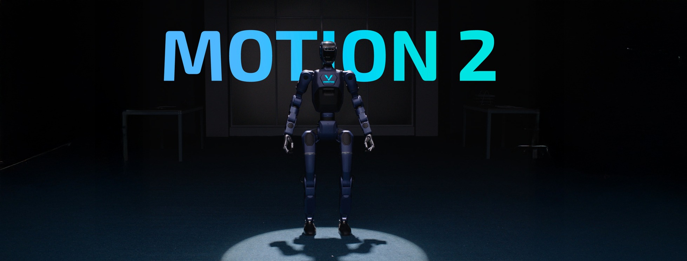

  

VinMotion is focusing on the R&D, production, and sales of consumer and industry-class high-performance general-purpose legged and humanoid robots, seven-axis manipulators, and so on. We attaches great importance to independent research and development and technological innovation, fully self-researching key core robot components such as motors, controllers, LIDAR and high-performance perception and motion control algorithms, integrating the entire robotics industry chain.

<table><tbody>

    
    Open source projects 

<!-- <tr><td colspan="1" rowspan="4"> -->

<table class="table table-striped table-bordered table-vcenter"/>
    <tbody>
    <tr><th> Title </th> <th>Description</th> <th>Stars</th> <th>Forks</th></tr>
    <tr>
        <td colspan="1" rowspan="1" align="center" >
            <a href="https://github.com/VinMotion-public" target="_blank"> Locomotion </a>
        </td>
        <td><a href="https://github.com/VinMotion-public/vmo_locomotion_release" target="_blank"> vmo_locomotion_release </a>   Locomotion implementation for Motion robots. </td>
        <td></td>
        <td></td>
    </tr>
    <tr>
        <td colspan="1" rowspan="2" align="center">
            <a href="https://www.ros.org/" target="_blank"> ROS2</a>
        </td>
        <td><a href="https://github.com/VinMotion-public/vmo_ros2_interface" target="_blank"> vmo_ros2_interface </a>   ROS2 interface package. </td>
        <td></td>
        <td></td>
    </tr>
    </tbody>
</table>

